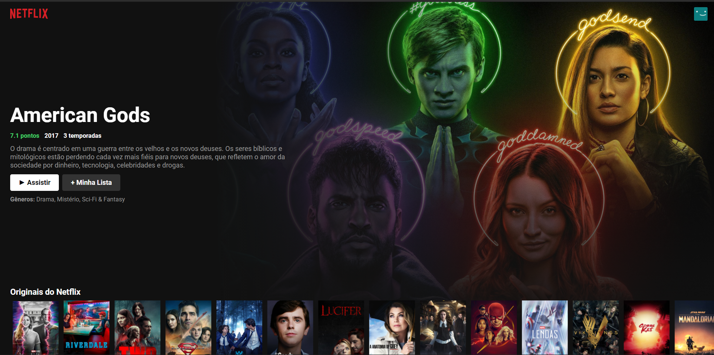
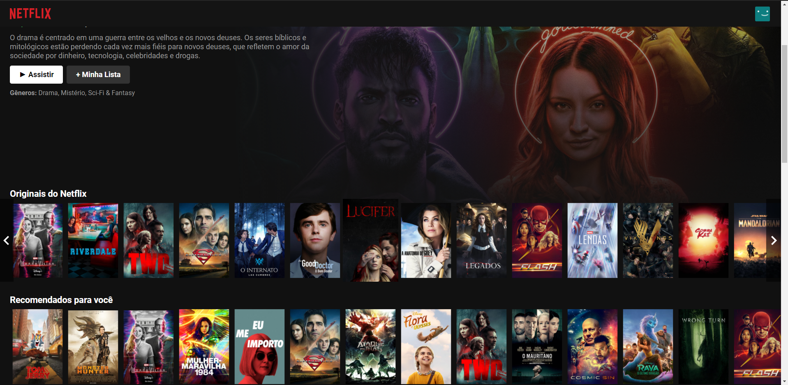
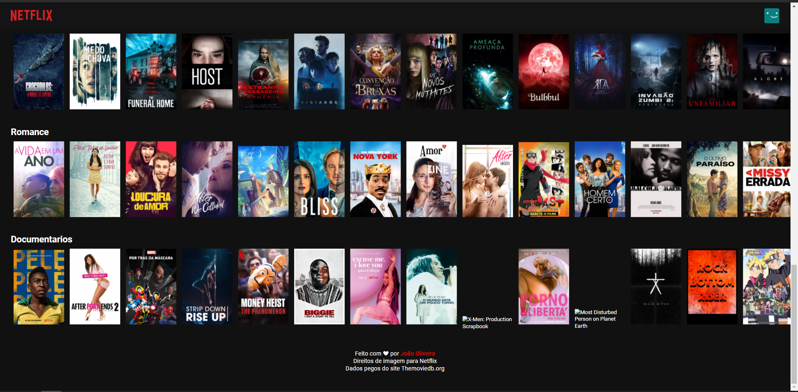

<h1 align="center">Netflix Clone</h1>

The monorepo of a application that allows users to schedule an appointment with their favorite barber and show the barber their schedule for the day.

    
    
    
    

 

<a href="https://joaoweb.com.br/Netflix_clone.gif" align="center"> VIDEO DEMONSTRATIVO DO APP </a> 

---

## 🚀 Technologies

This project was developed with the following technologies:

- ✔️ Typescript

- ✔️ ReactJS

- ✔️ React Native

- ✔️ Context API

- ✔️ Styled-components

- ✔️ React Spring

- ✔️ Polished

- ✔️ Docker

- ✔️ PostgreSQL

- ✔️ Axios

Made with 💜 by ARTHUR PC 👋 [See my linkedin](https://www.linkedin.com/in/arthurpc03/)
 
<a href="http://youtube.com/c/arthurpc">
  

    

      See my Youtube channel!

  

</a>
